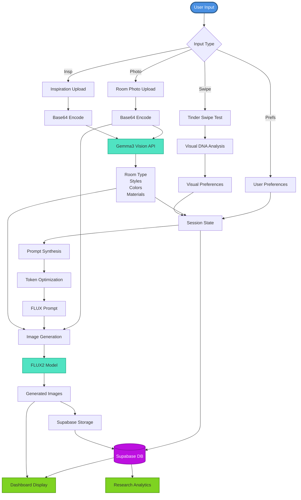
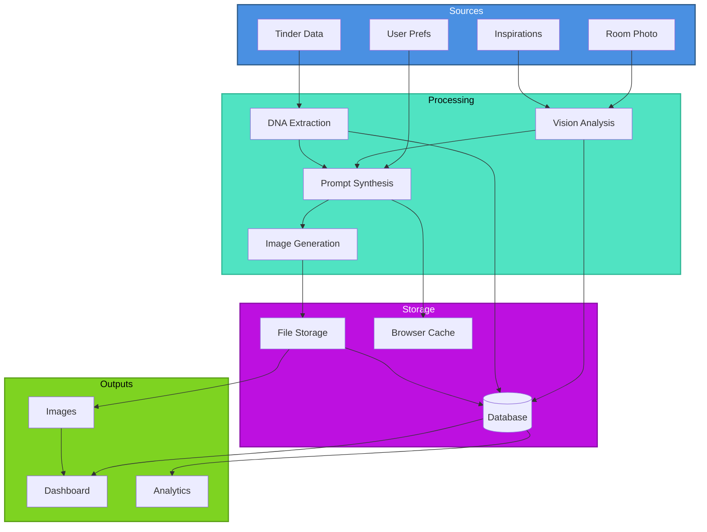
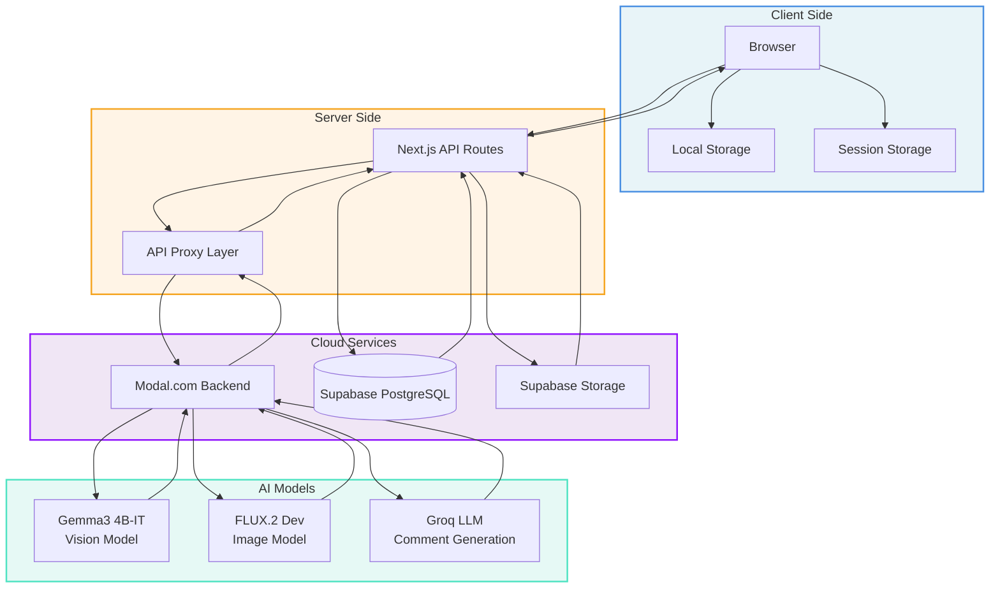

# AWA Project - Data Lineage Diagram

This document visualizes the complete data flow and lineage throughout the AWA (Aura) project, showing how data moves from user input through various transformations to final storage and display.

## Comprehensive Data Lineage Overview

```mermaid
flowchart TB
    subgraph Sources["📥 Data Sources"]
        direction TB
        U1[Room Photo<br/>JPEG/PNG]
        U2[Tinder Swipes<br/>33 Images + Behavioral Data]
        U3[User Preferences<br/>IPIP-60, Scales, Surveys]
        U4[Inspiration Images<br/>1-10 Images]
        U5[Demographics<br/>Age, Gender, Location]
        U6[Session Interactions<br/>Clicks, Time, Path]
    end
    
    subgraph Frontend["🖥️ Frontend Layer (Next.js)"]
        direction TB
        F1[Photo Upload<br/>Base64 Encoding]
        F2[Tinder Component<br/>Swipe Tracking]
        F3[Setup Wizards<br/>Form Collection]
        F4[Inspiration Upload<br/>Base64 Encoding]
        F5[Session State<br/>React State + localStorage]
        F6[API Client<br/>Fetch Requests]
    end
    
    subgraph API["🔌 API Routes (/api/modal)"]
        direction TB
        A1[/analyze-room<br/>POST]
        A2[/tinder<br/>POST]
        A3[/analyze-inspiration<br/>POST]
        A4[/generate<br/>POST]
        A5[/refine-prompt<br/>POST]
        A6[/log<br/>POST]
    end
    
    subgraph Backend["⚙️ Modal Backend (Python)"]
        direction TB
        B1[Gemma3 Vision<br/>Room Analysis]
        B2[Gemma3 Vision<br/>Inspiration Analysis]
        B3[Visual DNA<br/>Swipe Pattern Analysis]
        B4[Prompt Synthesis<br/>Multi-source Aggregation]
        B5[Prompt Refinement<br/>Token Optimization]
        B6[FLUX2 Model<br/>Image Generation]
        B7[Groq LLM<br/>Comment Generation]
    end
    
    subgraph Transformations["🔄 Data Transformations"]
        direction TB
        T1[Image → Base64<br/>String Encoding]
        T2[Base64 → PIL Image<br/>Image Processing]
        T3[Vision → JSON<br/>Room Metadata]
        T4[Swipes → DNA<br/>Pattern Extraction]
        T5[Multi-source → Prompt<br/>Synthesis Algorithm]
        T6[Prompt → Refined<br/>Token Optimization]
        T7[Image + Prompt → FLUX<br/>img2img Generation]
        T8[Base64 → PNG<br/>Image Encoding]
        T9[PNG → Supabase<br/>Storage Upload]
    end
    
    subgraph Storage["💾 Storage Systems"]
        direction TB
        S1[(Supabase PostgreSQL<br/>Sessions, Profiles, Swipes)]
        S2[Supabase Storage<br/>Generated Images]
        S3[Browser localStorage<br/>Session Data <4.5MB]
        S4[Browser sessionStorage<br/>Room Images Cache]
        S5[Modal Volume<br/>Model Cache]
    end
    
    subgraph Outputs["📤 Outputs & Display"]
        direction TB
        O1[Generated Images<br/>PNG URLs]
        O2[Dashboard<br/>User Interface]
        O3[Analytics<br/>Research Data]
        O4[Public URLs<br/>Image Links]
    end
    
    %% Source to Frontend
    U1 --> F1
    U2 --> F2
    U3 --> F3
    U4 --> F4
    U5 --> F3
    U6 --> F5
    
    %% Frontend to API
    F1 --> T1
    T1 --> A1
    F2 --> A2
    F3 --> F5
    F4 --> T1
    F5 --> A4
    F5 --> A6
    
    %% API to Backend
    A1 --> B1
    A2 --> B3
    A3 --> B2
    A4 --> B4
    A4 --> B6
    A5 --> B5
    
    %% Backend Processing
    B1 --> T2
    B2 --> T2
    T2 --> T3
    B3 --> T4
    T3 --> B4
    T4 --> B4
    F5 --> B4
    B4 --> T5
    T5 --> B5
    B5 --> T6
    T6 --> B6
    B1 --> B7
    
    %% Generation Flow
    T1 --> T7
    T6 --> T7
    T7 --> B6
    B6 --> T8
    T8 --> T9
    
    %% Storage
    F5 --> S3
    F5 --> S4
    B1 --> F5
    B2 --> F5
    B3 --> F5
    B4 --> F5
    T9 --> S2
    F5 --> S1
    S2 --> S1
    
    %% Outputs
    S2 --> O4
    O4 --> O1
    S1 --> O2
    S1 --> O3
    O1 --> O2
    
    %% Styling
    classDef source fill:#4A90E2,stroke:#2E5C8A,stroke-width:2px,color:#fff
    classDef frontend fill:#F5A623,stroke:#C87E0A,stroke-width:2px,color:#fff
    classDef api fill:#9013FE,stroke:#6A0DAD,stroke-width:2px,color:#fff
    classDef backend fill:#50E3C2,stroke:#2FB896,stroke-width:2px,color:#000
    classDef transform fill:#FF6B6B,stroke:#C92A2A,stroke-width:2px,color:#fff
    classDef storage fill:#BD10E0,stroke:#8B0FA8,stroke-width:2px,color:#fff
    classDef output fill:#7ED321,stroke:#5A9F18,stroke-width:2px,color:#000
    
    class U1,U2,U3,U4,U5,U6 source
    class F1,F2,F3,F4,F5,F6 frontend
    class A1,A2,A3,A4,A5,A6 api
    class B1,B2,B3,B4,B5,B6,B7 backend
    class T1,T2,T3,T4,T5,T6,T7,T8,T9 transform
    class S1,S2,S3,S4,S5 storage
    class O1,O2,O3,O4 output
```

## Main Data Lineage Flow

```mermaid
graph LR
    subgraph Input[" "]
        U1[Room Photo]
        U2[Tinder Swipes]
        U3[Preferences]
        U4[Inspirations]
    end
    
    subgraph Frontend["Frontend Layer"]
        F1[Photo Upload]
        F2[Tinder Test]
        F3[Setup Flow]
        F4[Inspiration Upload]
        F5[Session State]
    end
    
    subgraph API["API Routes"]
        A1[/analyze-room]
        A2[/tinder]
        A3[/analyze-inspiration]
        A4[/generate]
    end
    
    subgraph Backend["Modal Backend"]
        B1[Gemma3 Vision]
        B2[FLUX2 Model]
        B3[Groq LLM]
    end
    
    subgraph Storage["Storage"]
        S1[(Supabase DB)]
        S2[Supabase Storage]
        S3[localStorage]
    end
    
    subgraph Output["Output"]
        O1[Generated Images]
        O2[Dashboard]
        O3[Analytics]
    end
    
    U1 --> F1
    U2 --> F2
    U3 --> F3
    U4 --> F4
    
    F1 --> A1
    F2 --> A2
    F4 --> A3
    F5 --> A4
    
    A1 --> B1
    A3 --> B1
    A4 --> B2
    B1 --> B3
    
    B1 --> F5
    B2 --> O1
    B3 --> F5
    
    F5 --> S1
    F5 --> S3
    O1 --> S2
    S2 --> S1
    
    S1 --> O2
    S1 --> O3
    O1 --> O2
    
    classDef input fill:#4A90E2,stroke:#2E5C8A,stroke-width:2px,color:#fff
    classDef frontend fill:#F5A623,stroke:#C87E0A,stroke-width:2px,color:#fff
    classDef api fill:#9013FE,stroke:#6A0DAD,stroke-width:2px,color:#fff
    classDef backend fill:#50E3C2,stroke:#2FB896,stroke-width:2px,color:#000
    classDef storage fill:#BD10E0,stroke:#8B0FA8,stroke-width:2px,color:#fff
    classDef output fill:#7ED321,stroke:#5A9F18,stroke-width:2px,color:#000
    
    class U1,U2,U3,U4 input
    class F1,F2,F3,F4,F5 frontend
    class A1,A2,A3,A4 api
    class B1,B2,B3 backend
    class S1,S2,S3 storage
    class O1,O2,O3 output
```

## Detailed Data Transformation Flow



## Clean Network View



## System Architecture Overview



## Data Flow Summary

### 1. **Room Photo Analysis Flow**
```
User Upload → Base64 → /api/modal/analyze-room → Gemma3VisionModel 
→ Room Type + Comments → Session Data → Supabase
```

### 2. **Inspiration Analysis Flow**
```
User Upload → Base64 → /api/modal/analyze-inspiration → Gemma3VisionModel 
→ Styles/Colors/Materials/Biophilia → Session Data → Prompt Synthesis
```

### 3. **Image Generation Flow**
```
Session Data + Base Image + Prompt → /api/modal/generate → FLUX2Model 
→ Generated Images (base64) → Supabase Storage → Public URLs → Display
```

### 4. **Session Data Flow**
```
User Interactions → Frontend State → localStorage/sessionStorage 
→ Supabase sessions table → Sync on Load → Frontend State
```

### 5. **Tinder Swipe Flow**
```
User Swipes → Frontend → Visual DNA Analysis → Session Data 
→ Supabase (tinder_swipes, tinder_exposures) → Analytics
```

### 6. **Storage & Persistence**
- **Local**: localStorage (session data), sessionStorage (room images)
- **Remote**: Supabase Storage (generated images), Supabase PostgreSQL (metadata)
- **Cache**: In-memory cache for room analysis, sessionStorage for large images

## Key Data Transformations

1. **Image Encoding**: Raw image → Base64 string → Bytes → PIL Image
2. **Prompt Building**: User preferences + Room analysis + Inspiration tags → Synthesized prompt → Refined prompt (token optimization)
3. **Visual DNA**: Tinder swipes → Pattern analysis → Preference extraction → Visual DNA object
4. **Image Generation**: Base image + Prompt + Inspiration → FLUX2 img2img → Generated image (base64) → PNG → Supabase Storage → Public URL
5. **Session Sync**: Frontend state → JSON → Supabase sessions table → JSON → Frontend state

## Data Storage Locations

- **Supabase PostgreSQL**: Session metadata, user profiles, swipe data, generation sets, behavioral logs
- **Supabase Storage**: Generated images, inspiration images, room photos
- **Browser localStorage**: Session data (sanitized, <4.5MB)
- **Browser sessionStorage**: Room images cache, analysis cache
- **Modal Volume**: Model cache, temporary processing files

