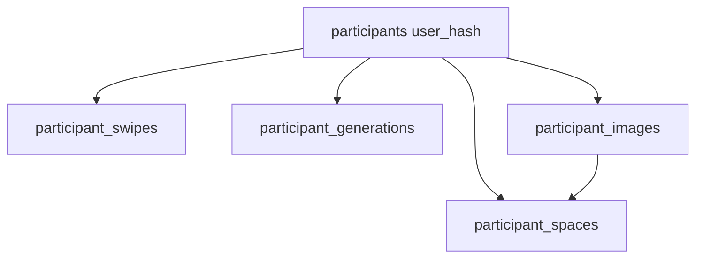

# Data model (canonical)

> Verified against code: 2026-06-11  
> Source of truth: `infra/gcp/sql/01_research_schema.sql` + migrations `02`–`21`

## Conceptual layers

| Layer | Description |
|-------|-------------|
| **Participant** | One row per `user_hash` — global profile, personality, aggregated implicit/explicit preferences |
| **Swipes** | One row per Tinder swipe with reaction time and image metadata |
| **Generations** | One row per generation job (prompt, parameters, latency, status) |
| **Images** | Stored files: generated, inspiration, room_photo |
| **Spaces** | User spaces (multi-room support; optional in flow) |

## Table: `participants`

Primary key: `user_hash` (anonymized identifier).

Key column groups:

| Group | Examples |
|-------|----------|
| Identification | `consent_timestamp`, `path_type` (`fast`\|`full`), `current_step` |
| Demographics | `age_range`, `gender`, `country`, `education` |
| Big Five | `big5_*` domains, `big5_facets` JSONB, `big5_responses` JSONB |
| Implicit (from swipes) | `implicit_dominant_style`, `implicit_style_*`, `implicit_color_*`, `implicit_material_*`, `implicit_warmth/brightness/complexity` |
| Explicit | `explicit_warmth`, `explicit_palette`, `explicit_style`, `explicit_material_*` |
| Sensory / biophilia | `sensory_music`, `sensory_texture`, `sensory_light`, `biophilia_score`, `nature_metaphor` |
| PRS | `prs_ideal_*`, `prs_current_*`, `prs_target_*` |
| Laddering | `ladder_path`, `ladder_core_need` |
| Surveys | `sus_score`, `clarity_score`, `agency_score`, `satisfaction_score`, `*_answers` JSONB |
| Room | `room_type`, `room_pain_points`, `room_activities`, `room_detected_type`, … |
| Aggregates | `tinder_total_swipes`, `inspirations_count`, `generations_count` |

## Table: `participant_swipes`

Per-swipe behavioural data:

- `direction`: `left` \| `right`
- `reaction_time_ms`
- `image_styles`, `image_colors`, `image_materials` (tags on stimulus)

## Table: `participant_generations`

- `job_type`: `initial` \| `micro` \| `macro`
- `prompt`, `parameters` JSONB, `source` (generation source label)
- `status`, `latency_ms`

## Table: `participant_images`

- `type`: `generated` \| `inspiration` \| `room_photo` \| `room_photo_empty`
- `storage_path`, `public_url`, VLM tags, optional `generation_id`, `space_id`

## Client persistence

All writes go through:

- `apps/frontend/src/lib/gcp-data.ts` → `gcp-api-client.ts` → Cloud Run API
- Session state: `localStorage` (`aura_session`, `aura_user_hash`) + sync to GCP

## Legacy

`apps/frontend/supabase/schema_full.sql` — historical reference only. **Not** the live schema.

## Migrations

Incremental SQL in `infra/gcp/sql/` (credits, auth, promo codes, snapshots, etc.). Apply via `infra/gcp/scripts/apply-research-migrations.ps1`.
