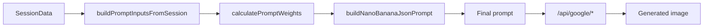

# Personalization pipeline (canonical)

> Verified against code: 2026-06-11  
> Sources: `prompt-synthesis/index.ts`, `GENERATION_MATRIX_5_IMAGES.md`, `SCORING_AUDIT.md`

## Overview

Main orchestrator: `apps/frontend/src/lib/prompt-synthesis/index.ts` — `synthesizePrompt()` / `synthesizeFivePrompts()`.

Pipeline stages:

1. **Input building** — `input-builder.ts` maps session fields to `PromptInputs`
2. **Scoring** — `scoring.ts` calculates weights across implicit, explicit, personality, inspiration
3. **Building** — `builder.ts` assembles structured prompt JSON
4. **Source filtering** — `modes.ts` — `GenerationSource` enum filters inputs per image slot
5. **Quality assessment** — `data-quality.ts` — viability checks per source
6. **Facet derivation** — `facet-derivation.ts` — Big Five facets → design descriptors
7. **Conflict analysis** — `conflict-analysis.ts` — implicit vs explicit mismatches

## Generation sources (5-image matrix)

| # | Source | Weighting / logic |
|---|--------|-------------------|
| 1 | `implicit` | Tinder swipes + inspiration VLM tags |
| 2 | `explicit` | Room-specific if `preferenceSource === 'complete'`, else Core Profile |
| 3 | `personality` | IPIP-NEO-120 domains + facets |
| 4 | `mixed` | 40% implicit + 30% explicit + 30% personality |
| 5 | `mixed_functional` | Mixed + activities, pain points, PRS gap |

## Blind comparison procedure

1. `synthesizeFivePrompts(sessionData, roomType)` — five prompts in parallel
2. `generateFiveImagesParallel()` — parallel image generation
3. Shuffle display order (`displayOrder`) — user does not know which source produced which image
4. User selection recorded for preference validation research

## Explainability metadata

`SynthesisResult.metadata.explainability` tracks per-element provenance:

- style, colors, materials — source: `implicit` \| `explicit` \| `personality` \| `blended` \| `inspiration`
- layout variation from `layout-diversity.ts`
- biophilia level and source

Useful for thesis discussion of transparency in AI-assisted design.

## Image generation API

Production: Google Vertex / Gemini via Next.js `/api/google/*` routes (not Modal).

## Fast vs full path

- **Fast:** simplified style selection → single generation path (no full 5-source matrix unless enabled on that screen)
- **Full:** complete profile + Big Five + room setup → full matrix and surveys

Verify current fast-generate behaviour in `apps/frontend/src/app/flow/fast-generate/` before claiming matrix usage on fast path in thesis.

## Related files

- `apps/frontend/src/lib/prompt-synthesis/` — full pipeline
- `GENERATION_MATRIX_5_IMAGES.md` — research design for 5-image study
- `apps/frontend/src/lib/prompt-synthesis/SCORING_AUDIT.md` — scoring validation notes
