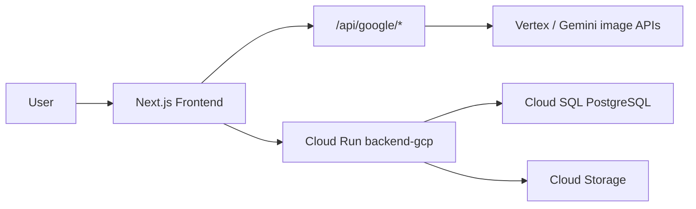

# System overview (canonical)

> Verified against code: 2026-06-11  
> Sources: `README.md`, `apps/frontend/src/lib/gcp-data.ts`, `docs/architecture.md` (updated)

## IDA platform

IDA is a research platform for studying interior design preferences, personality, and AI-assisted personalization in the context of environmental psychology.

## Architecture

| Layer | Technology | Location |
|-------|------------|----------|
| Frontend | Next.js 14, Three.js (IDA character) | Vercel — `apps/frontend/` |
| API | Express on Cloud Run | `apps/backend-gcp/` |
| Database | PostgreSQL (Cloud SQL) | Schema: `infra/gcp/sql/` |
| Object storage | Google Cloud Storage | Images, room photos |
| Image generation | Google Vertex / Gemini | Next.js routes `/api/google/*` |
| Client data layer | `gcp-data.ts` → `gcp-api-client.ts` | No Supabase at runtime |

From `gcp-data.ts`:

> All persistence goes through `gcpApi`; there is no Supabase runtime dependency.

## Monorepo layout

- `apps/frontend/` — user flows, IDA UI, prompt synthesis, GCP client
- `apps/backend-gcp/` — participants, swipes, generations, images, research routes
- `infra/gcp/sql/` — **source of truth** for database schema
- `thesis/` — doctoral dissertation drafts (Markdown)
- `docs/canon/` — verified documentation for thesis writing

## Legacy (not production)

| Legacy | Status |
|--------|--------|
| Modal.com Python backend | Archived in `docs/archive/modal-backend/` |
| Supabase auth/DB | Migrated to GCP; SQL kept in `apps/frontend/supabase/` for reference only |
| Repo name AWA-Project | Historical; product name is IDA |

## Research data collection

Three types (Research Through Design):

1. **Declarative** — questionnaire answers, scales, demographics
2. **Behavioural** — swipes, reaction times, dwell time, step progression
3. **Outcomes** — prompts, generation parameters, ratings, survey scores (SUS, clarity, etc.)

Persistence verification checklist (dev/QA only): `docs/gcp-data-verification/README.md`.
