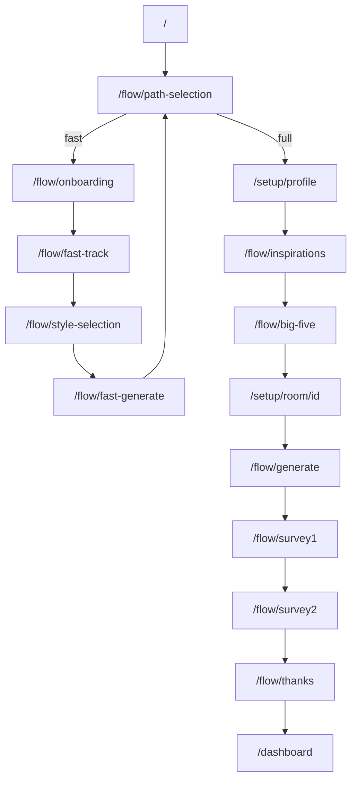

# User flow (canonical)

> Verified against code: 2026-06-11  
> Sources: `fast-flow-progress.ts`, `full-flow-progress.ts`, `RoomSetup.tsx`

## Entry

| Route | Screen | Notes |
|-------|--------|-------|
| `/` | Marketing landing | CTA to fast or full path |
| `/flow/path-selection` | Path selection | Sets `pathType`: `fast` \| `full` |
| `/start` | Redirect | → `/` |

Funnel routes (`/flow/*`, `/setup/*`) are **public without login**. After completion, users reach protected `/dashboard` and `/space/[id]`.

## Fast path — 4 steps

Defined in `FAST_FLOW_STEP_COUNT = 4` and `fast-flow-progress.ts`.

| Index | Route | Step | Data collected |
|-------|-------|------|----------------|
| 0 | `/flow/onboarding` | Consent + demographics | `consent_timestamp`, demographics |
| 1 | `/flow/fast-track` | Room photo upload | Room image |
| 2 | `/flow/style-selection` | Visual style choice | Explicit style preference |
| 3 | `/flow/fast-generate` | Generation + rating | Generation outcome, ratings |

After step 3: redirect to `/flow/path-selection?fast_completed=true` (upsell to full path).

**Note:** Full path does **not** use `/flow/onboarding` — consent is in `CoreProfileWizard` at `/setup/profile`.

## Full path — 12 steps

Defined in `FULL_FLOW_STEP_COUNT = 12` and `FULL_FLOW_USER_STEPS`.

| Index | User-facing label | Route / wizard | Wizard steps |
|-------|-------------------|----------------|--------------|
| 0 | Let's get started | `/setup/profile` | `consent` |
| 1 | About you | `/setup/profile` | `demographics`, `lifestyle` |
| 2 | Interior Tinder | `/setup/profile` | `tinder_swipes` |
| 3 | Interior mood | `/setup/profile` | `semantic_diff` |
| 4 | Senses | `/setup/profile` | `sensory_tests` |
| 5 | Inspirations | `/flow/inspirations` | Image upload + tagging |
| 6 | Personality | `/flow/big-five` | IPIP-NEO-120 |
| 7 | Space photo | `/setup/room/[id]` | `photo_upload` |
| 8 | Space needs | `/setup/room/[id]` | `preference_source`, `preference_questions`, `activities`, `usage_context`, `pain_points`, … |
| 9 | Mood of space | `/setup/room/[id]` | `prs_current`, `prs_target`, `summary` |
| 10 | Generation | `/flow/generate` | AI generation (+ inline modifications) |
| 11 | Your project | `/flow/survey1` → `/flow/survey2` → `/flow/thanks` | SUS, clarity → dashboard |

### Room setup internal order (`RoomSetup.tsx`)

`photo_upload` → `preference_source` → `preference_questions` → `prs_current` → `activities` → `usage_context` → `pain_points` → `prs_target` → `summary` → `/flow/generate`

## Diagram

## Legacy routes (not in main flow)

| Route | Status |
|-------|--------|
| `/flow/photo` | Older photo upload; not used in current fast-track |
| `/flow/dna` | Removed from main flow; implicit DNA from swipes in profile |
| `/flow/ladder` | Optional / legacy conversational laddering |
| `/flow/modify` | Separate modify page; generate also supports inline modify |
| `/setup/household` | Optional multi-room; not in linear path-selection flow |

## Source files

- `apps/frontend/src/lib/flow/fast-flow-progress.ts`
- `apps/frontend/src/lib/flow/full-flow-progress.ts`
- `apps/frontend/src/components/wizards/CoreProfileWizard.tsx`
- `apps/frontend/src/components/setup/RoomSetup.tsx`
